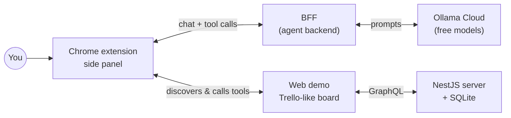

# WebMCP Lab

A hands-on playground for learning **WebMCP** and **agentic workflows**: web pages describe the actions they offer as _tools_, and an AI agent living in a Chrome side panel discovers those tools and uses them for you.

> **Status:** ✅ All four apps work: the board API, the web demo with WebMCP tools, the Chrome extension (tool inspector + agent chat) and the agent backend on free Ollama Cloud models. Next: polish and experiments (see the [roadmap](#roadmap)).

## What is WebMCP, in one minute?

Today, AI agents use websites by "looking" at the screen and clicking buttons, which is slow and fragile. [WebMCP](https://webmachinelearning.github.io/webmcp/) lets a page say what it can do instead:

```js
document.modelContext.registerTool({
  name: 'move_card',
  description: 'Move a card to another list',
  inputSchema: {
    type: 'object',
    properties: { cardId: { type: 'string' }, toList: { type: 'string' } },
  },
  execute: ({ cardId, toList }) => moveCard(cardId, toList),
});
```

An agent in the browser can then list the page's tools and call them directly, while you watch and approve.

## What we're building



| Piece                                                | What it does                                                           | Status   |
| ---------------------------------------------------- | ---------------------------------------------------------------------- | -------- |
| [`packages/tsconfig`](packages/tsconfig)             | Shared TypeScript settings                                             | ✅ Ready |
| [`packages/agent-protocol`](packages/agent-protocol) | The contract between the extension and the BFF                         | ✅ Ready |
| [`packages/ui`](packages/ui)                         | Shared design system (shadcn/ui + Tailwind)                            | ✅ Ready |
| [`apps/web-server-demo`](apps/web-server-demo)       | NestJS GraphQL API that stores boards, lists and cards in SQLite       | ✅ Ready |
| [`apps/web-demo`](apps/web-demo)                     | A Trello-like board that exposes its actions as WebMCP tools           | ✅ Ready |
| [`apps/chrome-ext`](apps/chrome-ext)                 | Side-panel extension that finds and runs WebMCP tools on any site      | ✅ Ready |
| [`apps/chrome-ext-bff`](apps/chrome-ext-bff)         | Agent backend that talks to Ollama Cloud and streams to the side panel | ✅ Ready |

Want the bigger picture? Read the [architecture overview](docs/architecture.md).

## Getting started

### Prerequisites

| You need                                                                                           | Why                                                                 |
| -------------------------------------------------------------------------------------------------- | ------------------------------------------------------------------- |
| [Node.js 24](https://nodejs.org) (with [nvm](https://github.com/nvm-sh/nvm): `nvm use`)            | Runs every app and tool                                             |
| [pnpm 12](https://pnpm.io) via [Corepack](https://nodejs.org/api/corepack.html): `corepack enable` | Installs the workspace; the exact version comes from `package.json` |
| Chrome 154+ with `chrome://flags/#enable-webmcp-testing` **Enabled**                               | WebMCP is still behind a flag                                       |
| A free [Ollama](https://ollama.com) account and API key                                            | The AI model the agent uses                                         |

### Run everything

```bash
nvm use && corepack enable
pnpm install
cp apps/chrome-ext-bff/.env.example apps/chrome-ext-bff/.env   # then paste your OLLAMA_API_KEY
pnpm --filter chrome-ext-bff smoke                             # optional: checks key, model and tool calls
pnpm dev                                                       # API :4000, web demo :5173, agent :8787, extension build
```

Then load the extension: open `chrome://extensions`, turn on **Developer mode**, click **Load unpacked** and pick `apps/chrome-ext/dist/chrome-mv3-dev`. Open <http://localhost:5173> and click the extension's icon.

The [demo walkthrough](docs/demo-walkthrough.md) shows what to try next.

## Everyday commands

| Command           | What it does                                                                           |
| ----------------- | -------------------------------------------------------------------------------------- |
| `pnpm check`      | Everything below except formatting fixes: run it before committing                     |
| `pnpm test`       | Runs every test in the workspace                                                       |
| `pnpm test:watch` | Re-runs tests as you edit                                                              |
| `pnpm lint`       | Lints with [oxlint](https://oxc.rs/docs/guide/usage/linter), type-aware, warnings fail |
| `pnpm format`     | Formats everything with [Prettier](https://prettier.io)                                |
| `pnpm typecheck`  | Type-checks every package                                                              |

Need just one package? Use pnpm's filter, for example `pnpm --filter @repo/agent-protocol test`, or Vitest's project flag: `pnpm test --project ui`.

## How the repository is organized

```text
.
├── apps/         # runnable applications (arriving phase by phase)
├── packages/     # shared code used by the apps
│   ├── agent-protocol/
│   ├── tsconfig/
│   └── ui/
└── docs/         # architecture notes and implementation plans
```

| Tool                                                       | Role                                                                                               |
| ---------------------------------------------------------- | -------------------------------------------------------------------------------------------------- |
| [pnpm workspaces](https://pnpm.io/workspaces)              | Links apps and packages together                                                                   |
| [pnpm catalog](https://pnpm.io/catalogs)                   | One place for shared dependency versions: [`pnpm-workspace.yaml`](pnpm-workspace.yaml)             |
| [Turborepo](https://turborepo.com)                         | Runs tasks across the workspace in the right order, with caching: [`turbo.json`](turbo.json)       |
| [Vitest](https://vitest.dev)                               | Tests for every app and package: [`vitest.config.ts`](vitest.config.ts)                            |
| [oxlint](https://oxc.rs) + [Prettier](https://prettier.io) | Linting and formatting: [`.oxlintrc.json`](.oxlintrc.json), [`.prettierrc.json`](.prettierrc.json) |

## Roadmap

| Phase | Goal                                                          | Status |
| ----- | ------------------------------------------------------------- | ------ |
| 0     | Workspace tooling                                             | ✅     |
| 1     | Shared packages                                               | ✅     |
| 2     | NestJS + SQLite server, Trello-like web demo, WebMCP tools    | ✅     |
| 3     | Chrome extension that discovers and runs WebMCP tools by hand | ✅     |
| 4     | Agent backend on Ollama Cloud, with chat in the side panel    | ✅     |
| 5     | Polish, docs and experiments                                  | 🔜     |

The full reasoning, technology choices and task breakdown live in the [implementation plan](docs/superpowers/plans/2026-10-03-webmcp-monorepo.md).
