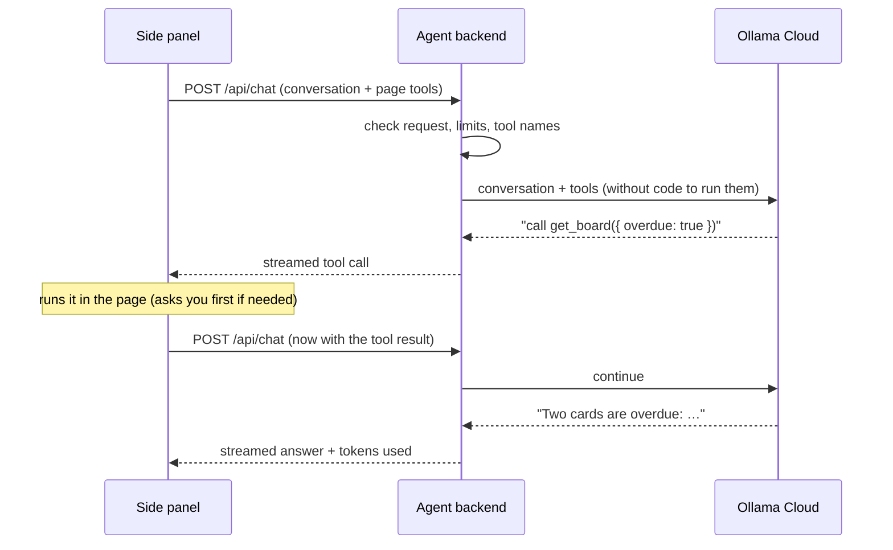

# chrome-ext-bff

The **agent backend** for the Chrome extension (BFF means "backend for frontend"). It holds the AI model's API key, sends the conversation and the page's tools to the model, and streams the answer back to the side panel.

It never touches web pages itself: when the model wants to use a tool, the backend streams that request to the side panel, which runs the tool in the page (after asking you, if needed) and sends the result back.

Built with [Hono](https://hono.dev) and the [Vercel AI SDK](https://ai-sdk.dev), using free [Ollama Cloud](https://docs.ollama.com/cloud) models.

## Set it up

1. Create an API key at [ollama.com → Settings → Keys](https://ollama.com/settings) (a free account is enough).
2. Create your settings file and paste the key:

   ```bash
   cp apps/chrome-ext-bff/.env.example apps/chrome-ext-bff/.env
   ```

3. Check that the key, the model and tool calling work (this spends a few tokens):

   ```bash
   pnpm --filter chrome-ext-bff smoke
   ```

4. Start it:

   ```bash
   pnpm --filter chrome-ext-bff dev        # http://127.0.0.1:8787, restarts on changes
   ```

   It's also started by `pnpm dev` at the repository root. If you create or change `.env` while it's running, restart it.

## Settings

All settings live in `apps/chrome-ext-bff/.env` (never committed). The [example file](.env.example) lists them:

| Variable                | Default                | What it does                                                       |
| ----------------------- | ---------------------- | ------------------------------------------------------------------ |
| `OLLAMA_API_KEY`        | _(required)_           | Your Ollama Cloud key. Stays in this process only.                 |
| `AI_MODEL`              | `gpt-oss:120b`         | Which model answers (see below)                                    |
| `AI_ALLOW_ANY_MODEL`    | `false`                | Set to `true` to use models outside the free tier                  |
| `AI_THINK`              | `low`                  | How much the model reasons first: `low`, `medium`, `high` or `off` |
| `PORT`                  | `8787`                 | Port on 127.0.0.1                                                  |
| `ALLOWED_ORIGINS`       | the extension's origin | Browser origins allowed to call the API                            |
| `MAX_TOOL_RESULT_CHARS` | `20000`                | Longer tool results are shortened before the model sees them       |

### Free models

Ollama's free usage covers these six cloud models. The backend refuses to start with any other model unless `AI_ALLOW_ANY_MODEL=true`, so you can't accidentally spend paid credits.

| Model                 | Good for                                            |
| --------------------- | --------------------------------------------------- |
| `gpt-oss:120b`        | The default: strong reasoning and tool use          |
| `gemma4:31b`          | A good alternative                                  |
| `nemotron-3-super`    | Very cheap input: long tool lists and conversations |
| `gpt-oss:20b`         | Fast and cheap, good while developing               |
| `nemotron-3-nano:30b` | The cheapest                                        |
| `nemotron-3-ultra`    | Hard multi-step tasks (expensive output)            |

The free allowance is small and resets monthly; check how much is left at [ollama.com/settings](https://ollama.com/settings). The side panel shows how many tokens each chat used.

## API

| Endpoint          | What it does                                                                                                              |
| ----------------- | ------------------------------------------------------------------------------------------------------------------------- |
| `GET /api/health` | Whether Ollama Cloud is reachable, accepts the key, and offers the model. Spends no tokens.                               |
| `POST /api/chat`  | Runs one chat turn and streams the answer ([AI SDK UI message stream](https://ai-sdk.dev/docs/ai-sdk-ui/stream-protocol)) |

A chat request carries the conversation plus the page the user is looking at. The exact shape is [`chatRequestBodySchema`](../../packages/agent-protocol/src/chat-api/chat-request-schema.ts):

```json
{
  "id": "chat-1",
  "messages": [
    { "id": "m1", "role": "user", "parts": [{ "type": "text", "text": "What's overdue?" }] }
  ],
  "pageContext": {
    "tabId": 7,
    "url": "http://localhost:5173/boards/abc",
    "origin": "http://localhost:5173",
    "title": "WebMCP Launch",
    "isTrustedOrigin": true,
    "tools": [
      {
        "name": "get_board",
        "description": "…",
        "inputSchema": { "type": "object" },
        "annotations": {
          "readOnlyHint": true,
          "consequentialHint": false,
          "untrustedContentHint": false
        },
        "origin": "http://localhost:5173"
      }
    ]
  }
}
```



## When something goes wrong

Errors explain what to do:

| You see                                        | Meaning                                  | Fix                                              |
| ---------------------------------------------- | ---------------------------------------- | ------------------------------------------------ |
| _Ollama Cloud rejected the API key_            | The key is wrong or revoked              | Paste a valid key into `.env` and restart        |
| _Your free Ollama Cloud usage is used up_      | You've used the monthly free allowance   | Wait for the reset, or add credits at ollama.com |
| _Ollama Cloud is busy_                         | The free plan runs one request at a time | Try again in a moment                            |
| _Could not reach Ollama Cloud_                 | No internet, or Ollama is down           | Check your connection                            |
| _The agent backend isn't running_ (side panel) | This server isn't started                | `pnpm --filter chrome-ext-bff dev`               |

## Security

- The API key only exists in this process. It is never sent to the extension or logged, and error messages never include it.
- The server listens on **127.0.0.1** only, so other machines can't reach it.
- Browsers must send the extension's origin. Other websites (or other extensions) get `403`.
- Everything the page sent is checked again here (sizes, tool limits, names), even though the extension already checked it.
- The model is told that tool descriptions and results are data from the website, never instructions.

## Code map

| Folder                     | Responsibility                                               |
| -------------------------- | ------------------------------------------------------------ |
| [`src/config`](src/config) | Reading and checking settings; the free-model list           |
| [`src/http`](src/http)     | The Hono app: routes, CORS, origin guard, size limit         |
| [`src/chat`](src/chat)     | One chat turn: tools for the model, system prompt, streaming |
| [`src/ollama`](src/ollama) | The Ollama Cloud model, health check and error messages      |
| [`scripts`](scripts)       | The smoke test                                               |

Tests use the AI SDK's mock model, so they never call Ollama or spend credits: `pnpm --filter chrome-ext-bff test`.
