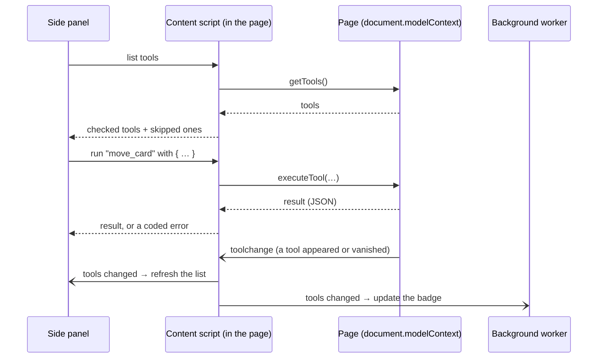

# chrome-ext

A Chrome extension that lives in the **side panel** and works with any website that offers [WebMCP](https://webmachinelearning.github.io/webmcp/) tools:

- it **finds** the tools the current page offers,
- shows what each one does and which ones claim to be safe,
- lets you **run** a tool by hand, exactly as an AI agent would,
- and (in the next phase) lets an AI agent run them for you, asking first when it matters.

It's built with [WXT](https://wxt.dev), [React](https://react.dev) and the shared [design system](../../packages/ui).

## Try it

1. Use **Chrome 154 or newer** and enable WebMCP: open `chrome://flags/#enable-webmcp-testing`, set it to **Enabled**, and relaunch Chrome.
2. Build the extension:

   ```bash
   pnpm --filter chrome-ext build      # or `pnpm --filter chrome-ext dev` to rebuild on changes
   ```

3. Open `chrome://extensions`, turn on **Developer mode**, click **Load unpacked**, and choose `apps/chrome-ext/.output/chrome-mv3`. With `dev`, choose `.output/chrome-mv3-dev`.
4. Open a page with WebMCP tools (for example the [web demo](../web-demo) at <http://localhost:5173>) and click the extension's toolbar icon. The side panel opens, and the badge on the icon shows how many tools the page offers.

The extension always has the same id, `dmnphemkaphmemfkmonbngjofhmbenck`, on every computer (see [Why the id never changes](#why-the-id-never-changes)).

## What you'll see

| View         | What it's for                                                                                     |
| ------------ | ------------------------------------------------------------------------------------------------- |
| **Tools**    | The current site, whether you trust it, its tools, and a form to run any tool with JSON arguments |
| **Chat**     | Talk to the AI agent (arrives in Phase 4)                                                         |
| **Settings** | The agent backend's address, automatic runs for read-only tools, your trusted sites, diagnostics  |

When a page can't show tools, the panel says why:

| Message                             | Meaning and fix                                                            |
| ----------------------------------- | -------------------------------------------------------------------------- |
| _WebMCP is not available_           | The browser has no WebMCP. Enable the flag above and relaunch Chrome.      |
| _Reload the page to connect_        | The tab was open before the extension loaded. Reload it.                   |
| _Extensions can't run on this page_ | Browser pages such as `chrome://` and the Chrome Web Store are off limits. |

## How the pieces talk



| Part                                                | Runs in            | Job                                                                           |
| --------------------------------------------------- | ------------------ | ----------------------------------------------------------------------------- |
| [Content script](src/entrypoints/webmcp.content.ts) | Every web page     | Talks to the page's WebMCP API and answers the side panel                     |
| [WebMCP host](src/webmcp-host/webmcp-host.ts)       | (inside the above) | Lists, runs and watches tools; handles timeouts, cancelling and Chrome quirks |
| [Background worker](src/entrypoints/background.ts)  | Extension          | Opens the side panel, connects already-open tabs, keeps the tool-count badge  |
| [Side panel](src/sidepanel)                         | Extension page     | Everything you see                                                            |
| [Messages](src/messaging/extension-messages.ts)     | Shared             | The exact shape of every message, checked on arrival                          |

## Staying safe on any website

Any site can offer tools and describe them however it likes, so the extension treats everything a page sends as **untrusted**:

- **Limits.** Tool lists, descriptions and schemas are capped and checked (see the [limits table](../../packages/agent-protocol/README.md#limits-for-untrusted-pages)). Anything the extension skips is listed with the reason.
- **Trust is yours to give.** Every site starts untrusted, except the local web demo. You can trust a site from the Tools view.
- **Labels are only believed on trusted sites.** A page can _claim_ a tool is read-only. The agent may only run such a tool without asking on a site you trust, and only if that's switched on in Settings. Everything else asks you first:

| The tool says… | Trusted site         | Untrusted site |
| -------------- | -------------------- | -------------- |
| read-only      | runs automatically\* | asks you       |
| changes data   | asks you             | asks you       |
| consequential  | asks you             | asks you       |

\* when "Run read-only tools on trusted sites without asking" is on.

The rule lives in [`decide-tool-approval.ts`](src/trust/decide-tool-approval.ts).

## Why these permissions?

| Permission      | Why it's needed                                                                        |
| --------------- | -------------------------------------------------------------------------------------- |
| `sidePanel`     | The whole UI lives in Chrome's side panel                                              |
| `storage`       | Saves your settings and trusted sites                                                  |
| `scripting`     | Connects tabs that were already open when the extension was installed                  |
| `webNavigation` | Resets the tool badge when a tab goes to a new page                                    |
| `<all_urls>`    | WebMCP tools can be on any website, so the content script must be able to run anywhere |

## Why the id never changes

Chrome normally derives an unpacked extension's id from its folder path, so it differs from machine to machine. The manifest includes a fixed public `key` (in [`wxt.config.ts`](wxt.config.ts)), which pins the id. The agent backend then allows requests from exactly one origin: `chrome-extension://dmnphemkaphmemfkmonbngjofhmbenck`.

The key was created like this. Only the public half is needed, so the private key isn't kept:

```bash
openssl genrsa -out private-key.pem 2048
openssl rsa -in private-key.pem -pubout -outform DER | base64     # → manifest "key"
```

## Scripts

| Command                          | What it does                                                    |
| -------------------------------- | --------------------------------------------------------------- |
| `pnpm --filter chrome-ext dev`   | Builds to `.output/chrome-mv3-dev` and rebuilds on every change |
| `pnpm --filter chrome-ext build` | Production build in `.output/chrome-mv3`                        |
| `pnpm --filter chrome-ext test`  | Unit and component tests (with WXT's fake browser)              |
| `pnpm --filter chrome-ext zip`   | Packs the build into a zip                                      |
