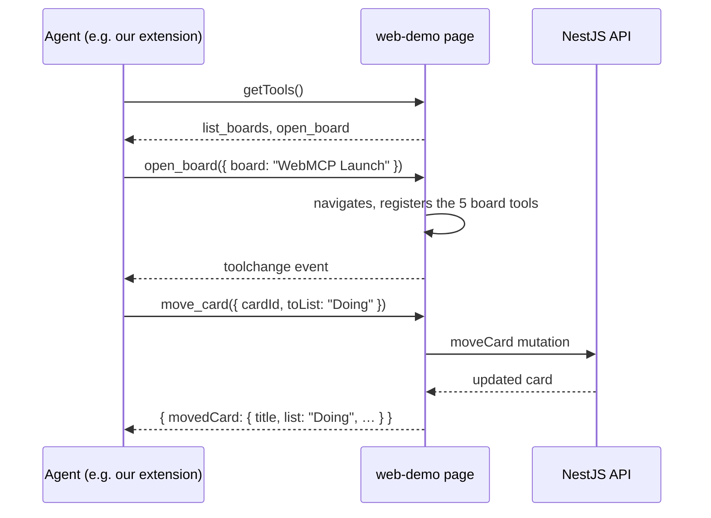
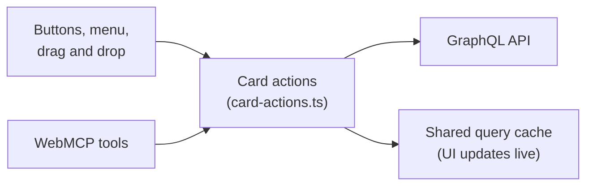

# web-demo

A small Trello-like app (**boards → lists → cards**) that does two jobs:

1. It's a normal web app: you create, edit, drag and archive cards.
2. It **offers its actions to AI agents as [WebMCP](https://webmachinelearning.github.io/webmcp/) tools**, so an agent in the browser (like our Chrome extension) can do the same things through structured calls instead of clicking around.

The data lives in the [NestJS server](../web-server-demo), which the app calls through GraphQL.

## Run it

```bash
pnpm dev:web          # from the repository root: API on :4000 and app on :5173
```

Or start them one at a time:

```bash
pnpm --filter web-server-demo build && pnpm --filter web-server-demo start   # API on :4000
pnpm --filter web-demo dev                                                     # app on :5173
```

Open <http://localhost:5173>. The app forwards `/graphql` to the server, so there's no CORS setup to do.

To let agents see the tools, use **Chrome 154 or newer** with `chrome://flags/#enable-webmcp-testing` set to **Enabled** (then relaunch Chrome). Without the flag, the app works normally and simply offers no tools.

## The tools agents can use

Tools come and go with the page: the two global tools are always there, and the board tools appear only while a board is open.

| Tool           | Available             | What it does                                                        | Marked as     |
| -------------- | --------------------- | ------------------------------------------------------------------- | ------------- |
| `list_boards`  | Everywhere            | Lists the boards with their size                                    | read-only     |
| `open_board`   | Everywhere            | Opens a board by name or id, which also adds the board tools        | read-only     |
| `get_board`    | While a board is open | Reads the lists and cards; can filter by text, label, list, overdue | read-only     |
| `create_card`  | While a board is open | Adds a card to a list (by list name or id)                          | –             |
| `update_card`  | While a board is open | Changes a card's title, description, due date, done flag or labels  | –             |
| `move_card`    | While a board is open | Moves a card to the top or bottom of a list                         | –             |
| `archive_card` | While a board is open | Archives a card; the page shows an **Undo** button                  | consequential |

"Read-only" and "consequential" are WebMCP hints. They help an agent (and the person approving its actions) decide what needs a second look.



### What a tool call looks like

An agent sends plain JSON. Lists and boards can be named instead of using ids:

```json
{ "cardId": "c0ffee…", "toList": "doing", "position": "top" }
```

and gets a short JSON answer back:

```json
{
  "movedCard": {
    "id": "c0ffee…",
    "title": "Fix card flicker",
    "labels": ["bug"],
    "list": "Doing",
    "position": 0
  }
}
```

When something is wrong, the answer explains how to fix it instead of failing silently:

```json
{
  "error": {
    "code": "NOT_FOUND",
    "message": "No list named \"Someday\". Lists on this board: Backlog, To Do, Doing, Done."
  }
}
```

## How a tool is built

Every tool lives in one file in [`src/webmcp/tools`](src/webmcp/tools) and is made of four parts:

| Part                  | Purpose                                                                                              |
| --------------------- | ---------------------------------------------------------------------------------------------------- |
| `name`, `description` | What the agent sees. Descriptions are written _for the agent_: what it does and when to use it.      |
| `annotations`         | Hints such as `readOnlyHint` or `consequentialHint`                                                  |
| `inputSchema`         | A [zod](https://zod.dev) schema. It becomes the JSON Schema agents see **and** validates their input |
| `execute`             | Calls the same [card actions](src/features/boards/api/card-actions.ts) the UI uses                   |



Because the UI and the tools share one set of actions, an agent's change behaves exactly like a click, and the board on screen updates immediately.

### Adding a tool

1. Create `src/webmcp/tools/my-tool.ts` with `defineWebMcpTool({ name, description, inputSchema, execute })`.
2. Register it with `useWebMcpTool(myTool, context)`: in [`global-webmcp-tools.tsx`](src/webmcp/global-webmcp-tools.tsx) to offer it everywhere, or in [`board-webmcp-tools.tsx`](src/webmcp/board-webmcp-tools.tsx) to offer it only on board pages.
3. Add tests next to the others ([`board-tools.test.ts`](src/webmcp/tools/board-tools.test.ts) shows the pattern).

The [`useWebMcpTool`](src/webmcp/use-webmcp-tool.ts) hook takes care of the WebMCP details: it registers the tool when the component mounts, and removes it when the component unmounts by aborting the registration (WebMCP has no "unregister" call).

## How the code is organized

| Folder                                       | What's inside                                                                          |
| -------------------------------------------- | -------------------------------------------------------------------------------------- |
| [`src/routes`](src/routes)                   | Pages, using [TanStack Router](https://tanstack.com/router) file-based routes          |
| [`src/features/boards`](src/features/boards) | The board feature: data queries, card actions, components, drag and drop               |
| [`src/webmcp`](src/webmcp)                   | The WebMCP layer: the registration hook and the tools                                  |
| [`src/graphql`](src/graphql)                 | `executeGraphql()`, the one function that talks to the API                             |
| `src/gql`                                    | Types generated from the server's [schema](../web-server-demo/schema.gql) (don't edit) |

## Scripts

| Command                          | What it does                                                |
| -------------------------------- | ----------------------------------------------------------- |
| `pnpm --filter web-demo dev`     | Starts the app with hot reload                              |
| `pnpm --filter web-demo codegen` | Regenerates GraphQL types after the server's schema changes |
| `pnpm --filter web-demo test`    | Runs the component, action and tool tests                   |
| `pnpm --filter web-demo build`   | Builds the production bundle                                |
