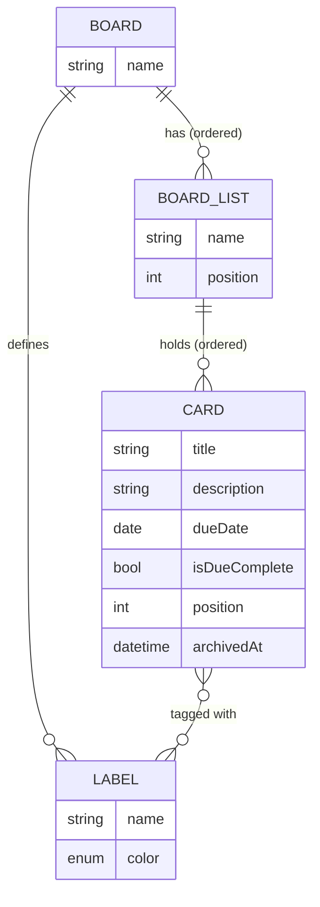
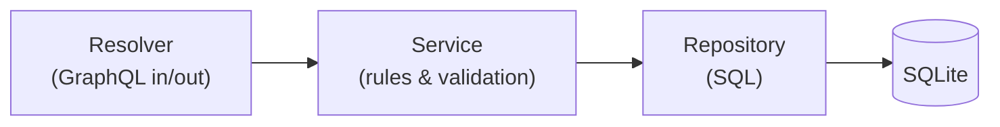

# web-server-demo

The backend of the Trello-like demo: a [NestJS](https://nestjs.com) server with a [GraphQL](https://graphql.org/learn/) API that stores **boards**, **lists**, **cards** and **labels** in [SQLite](https://www.sqlite.org).

The [web demo](../web-demo) calls this API from its UI _and_ from the WebMCP tools it exposes to AI agents, so every agent action goes through the same rules as a click.

## Run it

```bash
pnpm --filter web-server-demo build
pnpm --filter web-server-demo start      # http://localhost:4000/graphql
```

- Open <http://localhost:4000/graphql> in a browser to explore the API with **GraphiQL**.
- The first start creates `data/dev.sqlite` and fills it with two demo boards. Delete that file to start over.
- During development, `pnpm --filter web-server-demo dev` rebuilds and restarts on every change.

Settings come from environment variables. Copy [`.env.example`](.env.example) to `.env` to change them:

| Variable        | Default                 | What it does                                        |
| --------------- | ----------------------- | --------------------------------------------------- |
| `PORT`          | `4000`                  | Port the API listens on                             |
| `DATABASE_PATH` | `data/dev.sqlite`       | SQLite file to use (`:memory:` for a throwaway one) |
| `CORS_ORIGIN`   | `http://localhost:5173` | The web demo's address, allowed to call the API     |

## The data model



A few rules worth knowing:

- **Order is a number.** Lists and cards have a `position` (0, 1, 2, …). Moving or archiving a card renumbers the others, so there are never gaps.
- **Archiving is reversible.** An archived card disappears from its list; `restoreCard` brings it back at the bottom of the same list.
- **Overdue** means the due date is before today, the card isn't marked complete (`isDueComplete`), and it isn't archived.
- **Labels are referenced by name**, in any letter case (`"URGENT"` finds `urgent`). This makes the API easy for AI agents to use.

The complete API is in [`schema.gql`](schema.gql).

## Example requests

Find overdue cards on a board:

```graphql
query OverdueCards($boardId: ID!) {
  searchCards(boardId: $boardId, filter: { isOverdue: true }) {
    title
    dueDate
    list {
      name
    }
    labels {
      name
    }
  }
}
```

Move a card to the top of another list:

```graphql
mutation MoveToTop($cardId: ID!, $doingListId: ID!) {
  moveCard(id: $cardId, input: { toListId: $doingListId, position: TOP }) {
    position
    list {
      name
    }
  }
}
```

## When something goes wrong

Every error has a machine-readable `extensions.code` and a message that says how to fix it:

| Code             | Meaning                                  | Example message                                                            |
| ---------------- | ---------------------------------------- | -------------------------------------------------------------------------- |
| `NOT_FOUND`      | The board, list or card id doesn't exist | `Card "abc" was not found.`                                                |
| `BAD_USER_INPUT` | The request asks for something invalid   | `Unknown label(s): someday. Available labels: bug, docs, feature, urgent.` |

## How the code is organized

| Folder                                               | Responsibility                                                               |
| ---------------------------------------------------- | ---------------------------------------------------------------------------- |
| [`src/boards`](src/boards)                           | Boards and their lists: GraphQL types, resolvers, service and SQL            |
| [`src/cards`](src/cards)                             | Cards: create, update, move, archive, restore, search                        |
| [`src/labels`](src/labels)                           | Board labels and their colors                                                |
| [`src/database`](src/database)                       | Opening SQLite, [migrations](src/database/migrations) and the demo seed data |
| [`src/config`](src/config), [`src/clock`](src/clock) | Settings from the environment, and the injectable "today"                    |
| [`test`](test)                                       | End-to-end tests that call the real GraphQL API                              |

Each feature follows the same layering:



## Changing the API

The web demo builds its typed GraphQL client from [`schema.gql`](schema.gql), so keep that file current:

1. Change the resolvers or GraphQL models.
2. Run `pnpm --filter web-server-demo schema` to rewrite `schema.gql`.
3. Commit the updated file. A test fails if you forget.

## Tests

| Command                                  | What it runs                                                 |
| ---------------------------------------- | ------------------------------------------------------------ |
| `pnpm --filter web-server-demo test`     | Unit tests for services, repositories, migrations and config |
| `pnpm --filter web-server-demo test:e2e` | End-to-end GraphQL tests on a fresh in-memory database       |

Unit tests use a real SQLite database in memory instead of mocks, so the actual SQL is always exercised.

### Good to know

- **NestJS dependency injection and type-only imports.** NestJS finds what to inject by reading the constructor's parameter types at runtime. If a class is imported with `import type`, that information disappears and injection silently breaks. That's why the linter's "use `import type`" rule is turned off for this app in [`.oxlintrc.json`](../../.oxlintrc.json).
- **One copy of `graphql` in tests.** The `graphql` package ships two builds. [`vitest.shared.ts`](vitest.shared.ts) makes tests load the same one NestJS uses.
