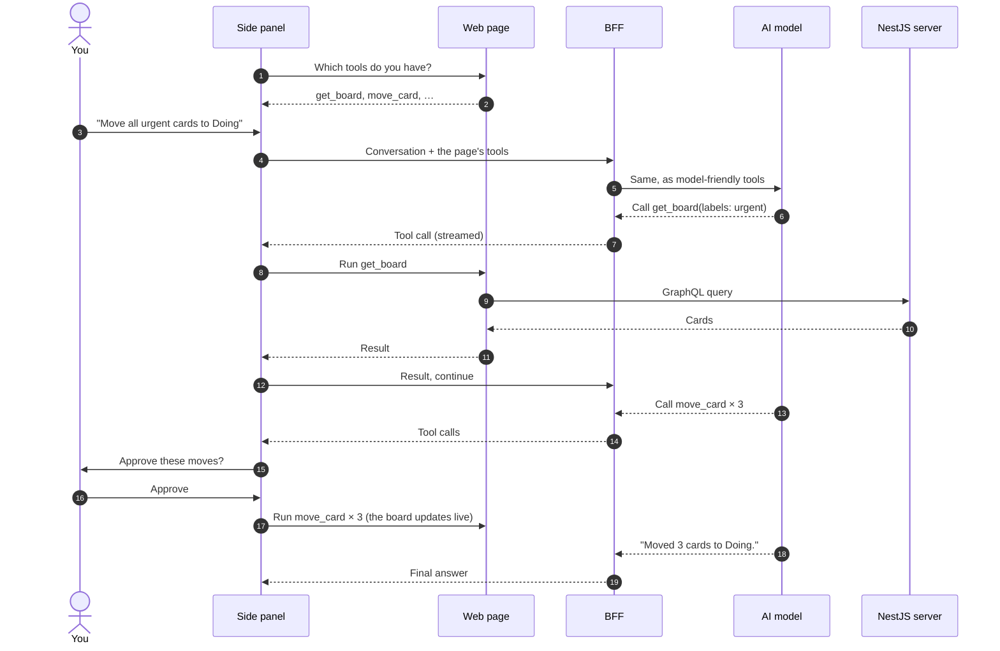
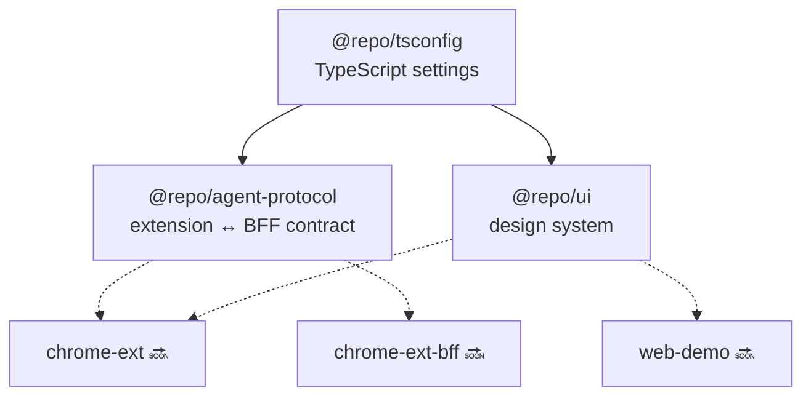

# Architecture overview

This page explains how the pieces of WebMCP Lab fit together. It grows as each phase lands; parts marked 🔜 describe the planned design.

## The big idea

Each part of the system has one job, and secrets stay on the server.

| Part                        | Its one job                                                                    | Knows about                     |
| --------------------------- | ------------------------------------------------------------------------------ | ------------------------------- |
| **Web page** (web demo)     | Offers its actions as WebMCP tools and runs them when asked                    | Its own app; nothing about AI   |
| **Chrome extension**        | Finds the page's tools, asks you before risky actions, runs the tools          | The page's tools, your approval |
| **BFF** (agent backend)     | Talks to the AI model and decides _which_ tool to call next                    | The model and the API key       |
| **AI model** (Ollama Cloud) | Reads the conversation and the tool list, then answers or requests a tool call | Only what the BFF sends it      |
| **Server** (NestJS)         | Stores boards, lists and cards                                                 | The database                    |

## How one request flows 🔜

You ask the side panel: _"Move all urgent cards to Doing"_.

Notice that **the model never touches the page directly**. It only _asks_ for tool calls, and the extension carries them out after the checks described below.

## Staying safe on any website

The extension works on any site that uses WebMCP, and any site can describe its tools however it likes. So everything a page sends is treated as untrusted:

- **Size limits.** A page can expose at most 64 tools, and descriptions and schemas have size caps. The full table is in the [agent-protocol README](../packages/agent-protocol/README.md#limits-for-untrusted-pages).
- **Approval first.** On sites you haven't marked as trusted, every tool call needs your click, even ones the page claims are "read-only".
- **Safe tool names.** Page tool names are converted into names every AI provider accepts, and converted back before running. See [how tool names are translated](../packages/agent-protocol/README.md#translating-tool-names-for-the-model).

## Shared packages ✅

| Package                                              | Used by                | Read more                                                   |
| ---------------------------------------------------- | ---------------------- | ----------------------------------------------------------- |
| [`@repo/tsconfig`](../packages/tsconfig)             | Everything             | [Which preset to use](../packages/tsconfig/README.md)       |
| [`@repo/agent-protocol`](../packages/agent-protocol) | Extension and BFF      | [Contract and limits](../packages/agent-protocol/README.md) |
| [`@repo/ui`](../packages/ui)                         | Web demo and extension | [Using the design system](../packages/ui/README.md)         |

Shared packages ship their TypeScript source directly; there is no separate build step. Each app's bundler (Vite, or WXT for the extension) compiles the package code together with the app.

## Where to go next

- The [implementation plan](superpowers/plans/2026-10-03-webmcp-monorepo.md) explains every technology choice and the phased roadmap.
- The [WebMCP specification](https://webmachinelearning.github.io/webmcp/) and [Chrome's WebMCP guide](https://developer.chrome.com/docs/ai/webmcp) describe the browser API itself.
