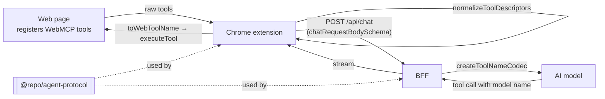

# @repo/agent-protocol

The shared contract between the **Chrome extension** and its **BFF** (the backend that talks to the AI model). Both sides import this package, so they always agree on:

- what a WebMCP tool looks like once it leaves a web page,
- how much a page is allowed to send (pages are untrusted),
- how tool names are rewritten for the model and translated back,
- what a chat request and an error response look like.



## What's inside

| Export                                                                             | What it does                                                                               |
| ---------------------------------------------------------------------------------- | ------------------------------------------------------------------------------------------ |
| [`normalizeToolDescriptors`](./src/tool-descriptors/normalize-tool-descriptors.ts) | Cleans up the raw tool list from a page and reports anything it had to skip, with a reason |
| [`UNTRUSTED_INPUT_LIMITS`](./src/tool-descriptors/untrusted-input-limits.ts)       | The caps applied to everything a page sends (see the table below)                          |
| [`webMcpToolDescriptorSchema`](./src/tool-descriptors/tool-descriptor-schema.ts)   | The validated shape of one tool                                                            |
| [`createToolNameCodec`](./src/tool-names/tool-name-codec.ts)                       | Converts page tool names into names every model provider accepts, and back                 |
| [`chatRequestBodySchema`](./src/chat-api/chat-request-schema.ts)                   | The body of `POST /api/chat`: the conversation plus the page context and its tools         |
| [`createApiErrorBody` and `apiErrorBodySchema`](./src/chat-api/api-error.ts)       | One error format for every BFF failure, with a fixed list of error codes                   |

## Limits for untrusted pages

Any website can register WebMCP tools, so the extension and the BFF both enforce these limits.

| Limit                      | Value      | What happens when a page exceeds it                        |
| -------------------------- | ---------- | ---------------------------------------------------------- |
| Tools per page             | 64         | Tools are sorted by name; the extra ones are skipped       |
| Tool name length           | 128 chars  | The tool is skipped                                        |
| Tool title length          | 128 chars  | The title is shortened                                     |
| Tool description length    | 1024 chars | The description is shortened and ends with `… [truncated]` |
| Input schema size          | 16 KB      | The tool is skipped                                        |
| Input schema nesting depth | 24 levels  | The tool is skipped                                        |

## Examples

### Cleaning up a page's tools

```ts
import { normalizeToolDescriptors } from '@repo/agent-protocol';

const { tools, rejectedTools } = normalizeToolDescriptors(
  [
    { name: 'move_card', description: 'Move a card', inputSchema: '{"type":"object"}' },
    { name: 'broken', description: 'Bad schema', inputSchema: '{ not json' },
  ],
  'http://localhost:5173',
);

// tools         → [{ name: 'move_card', inputSchema: { type: 'object' }, annotations: { readOnlyHint: false, … }, origin: 'http://localhost:5173', … }]
// rejectedTools → [{ name: 'broken', reason: 'invalid-input-schema' }]
```

### Translating tool names for the model

Model providers only accept names made of letters, digits, `_` and `-`, up to 64 characters. Pages can use anything.

```ts
import { createToolNameCodec } from '@repo/agent-protocol';

const codec = createToolNameCodec(['move_card', 'cards.archive']);

codec.toModelToolName('move_card'); // 'move_card' (already safe, unchanged)
codec.toModelToolName('cards.archive'); // 'cards_archive_0v6o5to' (made safe, with a short unique suffix)
codec.toWebToolName('cards_archive_0v6o5to'); // 'cards.archive'
```

The result depends only on _which_ names are in the list, never their order, so the extension and the BFF can each build their own codec and always agree.

## Scripts

| Command                                        | What it does            |
| ---------------------------------------------- | ----------------------- |
| `pnpm --filter @repo/agent-protocol test`      | Runs the unit tests     |
| `pnpm --filter @repo/agent-protocol typecheck` | Type-checks the package |
