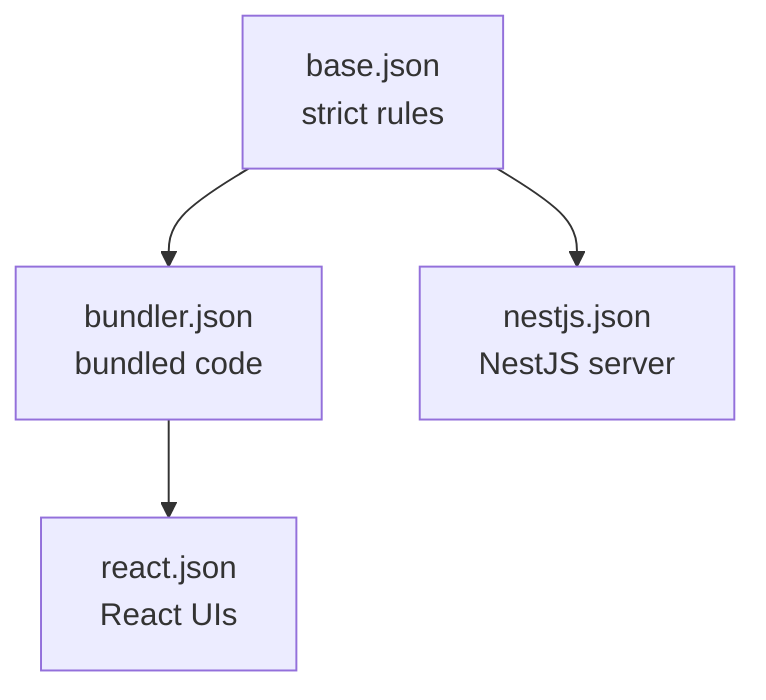

# @repo/tsconfig

Shared TypeScript settings, so every app and package in the workspace follows the same strict rules without copying compiler options around.

## Which preset should I use?

| Preset                           | Use it for                                                                            | What it adds                                                                         |
| -------------------------------- | ------------------------------------------------------------------------------------- | ------------------------------------------------------------------------------------ |
| [`base.json`](./base.json)       | Nothing directly; every other preset builds on it                                     | Strict type checking and modern JavaScript output                                    |
| [`bundler.json`](./bundler.json) | Code that a bundler (Vite, WXT, tsdown) compiles, such as shared packages and the BFF | Bundler-style imports; TypeScript only checks types and never writes files           |
| [`react.json`](./react.json)     | React apps and UI packages                                                            | Everything in `bundler.json`, plus JSX and browser (DOM) types                       |
| [`nestjs.json`](./nestjs.json)   | The NestJS server                                                                     | Node.js ESM imports and the decorator metadata NestJS needs for dependency injection |



## Example

A React app's `tsconfig.json` only needs to pick a preset and say which files it covers:

```json
{
  "extends": "@repo/tsconfig/react.json",
  "include": ["src"]
}
```

Add the package as a dev dependency first:

```json
{
  "devDependencies": {
    "@repo/tsconfig": "workspace:*"
  }
}
```

## Why these rules?

- **`strict` plus `noUncheckedIndexedAccess`**: reading `items[0]` gives you `Item | undefined`, so a missing value can't slip through unnoticed.
- **`verbatimModuleSyntax`**: type-only imports must say `import type`, which keeps bundles free of imports that only exist for types.
- **The TypeScript version is pinned to 6.0.** TypeScript 7 is out, but the NestJS GraphQL package doesn't support it yet. See the [technology choices in the plan](../../docs/superpowers/plans/2026-10-03-webmcp-monorepo.md#3-technology-choices-versions-verified-on-the-npm-registry-2026-10-03).
