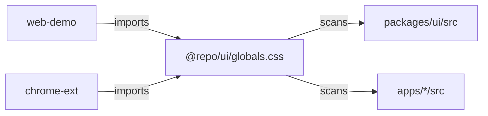

# @repo/ui

The shared design system used by the **web demo** and the **Chrome extension**, so both look and behave the same.

It's built from [shadcn/ui](https://ui.shadcn.com) components (Nova style on [Base UI](https://base-ui.com) primitives) and styled with [Tailwind CSS 4](https://tailwindcss.com).

## What's inside

| Folder                                               | Contents                                                                |
| ---------------------------------------------------- | ----------------------------------------------------------------------- |
| [`src/components`](./src/components)                 | Ready-to-use components: Button, Card, Dialog, Select, Tooltip and more |
| [`src/lib/utils.ts`](./src/lib/utils.ts)             | `cn()`, which merges Tailwind class names without conflicts             |
| [`src/styles/globals.css`](./src/styles/globals.css) | The theme: colors, radii, light and dark mode                           |

## Using it in an app

**1. Add the dependency** to the app's `package.json`:

```json
{
  "dependencies": {
    "@repo/ui": "workspace:*"
  }
}
```

**2. Import the styles once**, in the app's main CSS file:

```css
@import '@repo/ui/globals.css';
```

**3. Import components** wherever you need them:

```tsx
import { Button } from '@repo/ui/components/button';
import { cn } from '@repo/ui/lib/utils';

export function SaveButton({ isSaving }: { isSaving: boolean }) {
  return (
    <Button className={cn(isSaving && 'opacity-60')} disabled={isSaving}>
      Save card
    </Button>
  );
}
```

> The Tooltip component needs its provider: wrap the app once in `<TooltipProvider>` (from `@repo/ui/components/tooltip`).

## Adding another shadcn component

Run the shadcn CLI from the repository root and point it at this package:

```bash
pnpm dlx shadcn@4.21.1 add accordion -c packages/ui
```

The CLI reads [`components.json`](./components.json) to know where files go. Components land in `src/components`, and any new dependency gets added to this package. Then:

1. Move the new dependency's version into the [workspace catalog](../../pnpm-workspace.yaml) and reference it as `catalog:`.
2. Run `pnpm format` so the generated file matches the repo's code style.

## How the styles reach every app

Tailwind only generates the CSS classes it finds in the files it scans. [`globals.css`](./src/styles/globals.css) tells it to scan this package **and** every app's `src` folder. Classes used anywhere in the workspace therefore just work.



## Scripts

| Command                            | What it does                                  |
| ---------------------------------- | --------------------------------------------- |
| `pnpm --filter @repo/ui test`      | Runs the component tests (in a simulated DOM) |
| `pnpm --filter @repo/ui typecheck` | Type-checks the package                       |
